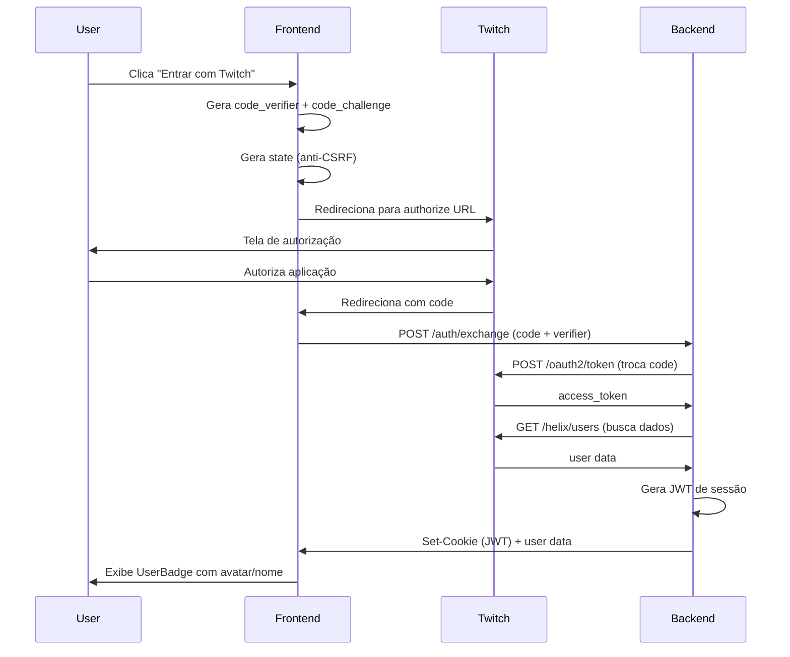

# Autenticação Twitch - Guia de Configuração

Este projeto implementa autenticação OAuth 2.0 com Twitch usando PKCE (Proof Key for Code Exchange) para máxima segurança.

## Arquitetura

### Frontend
- **TwitchLoginButton** (`src/components/TwitchLoginButton.tsx`): Botão que inicia o fluxo OAuth com PKCE
- **UserBadge** (`src/components/UserBadge.tsx`): Exibe avatar, nome e saldo do usuário autenticado
- **useTwitchAuth** (`src/hooks/useTwitchAuth.tsx`): Hook para gerenciar estado de autenticação
- **TwitchCallback** (`src/pages/TwitchCallback.tsx`): Página que processa o retorno do OAuth

### Backend (Edge Functions)
- **twitch-auth-exchange**: Troca o code por access token e gera JWT de sessão
- **twitch-auth-me**: Valida sessão e retorna dados do usuário
- **twitch-auth-logout**: Invalida sessão

## Configuração Passo a Passo

### 1. Configurar Aplicação na Twitch

1. Acesse [Twitch Developer Console](https://dev.twitch.tv/console)
2. Clique em **"Applications"** → **"Register Your Application"**
3. Preencha:
   - **Name**: Nome da sua aplicação
   - **OAuth Redirect URLs**: 
     - `https://<SEU-DOMINIO>/auth/twitch/callback` (produção)
     - `https://<SEU-PREVIEW>.lovableproject.com/auth/twitch/callback` (desenvolvimento)
   - **Category**: Website Integration
   - **Client Type**: Confidential
4. Clique em **"Create"**
5. Copie o **Client ID** e **Client Secret** (guarde em local seguro!)

### 2. Adicionar Secrets no Lovable

No Lovable, adicione os seguintes secrets:

1. **TWITCH_CLIENT_ID**: O Client ID da sua aplicação Twitch
2. **TWITCH_CLIENT_SECRET**: O Client Secret da sua aplicação Twitch
3. **JWT_SECRET**: Uma string aleatória longa para assinar JWTs (ex: `openssl rand -base64 32`)

### 3. Verificar Configuração

Teste o fluxo de login:

1. Abra o site em uma aba anônima
2. Clique em "Entrar com Twitch"
3. Autorize a aplicação
4. Você deve ser redirecionado de volta e ver seu avatar e nome no header

## Segurança

- ✅ **PKCE (S256)**: Protege contra ataques de interceptação
- ✅ **State parameter**: Previne CSRF attacks
- ✅ **HttpOnly cookies**: JWT armazenado de forma segura
- ✅ **Secure flag**: Cookies apenas em HTTPS
- ✅ **SameSite=Lax**: Proteção adicional contra CSRF
- ✅ **Expiração de 24h**: Tokens de sessão expiram automaticamente

## Fluxo de Autenticação

## Troubleshooting

### Erro: "Invalid redirect_uri"
- Verifique se o redirect URI está **exatamente** como configurado na Twitch Developer Console
- Certifique-se de incluir o protocolo (https://) e a rota completa (/auth/twitch/callback)

### Erro: "Invalid state parameter"
- O state pode ter expirado. Tente fazer login novamente.
- Verifique se o sessionStorage está habilitado no navegador

### Erro: "Not authenticated" ao buscar saldo
- Verifique se o cookie twitch_session está sendo enviado
- Confirme que o JWT_SECRET está configurado corretamente
- Veja os logs da edge function `loyalty-balance` para mais detalhes

### Usuário não vê saldo
- Verifique se o provedor de pontos está configurado (veja README_LOYALTY.md)
- Confirme que o login da Twitch do usuário existe no sistema de pontos
